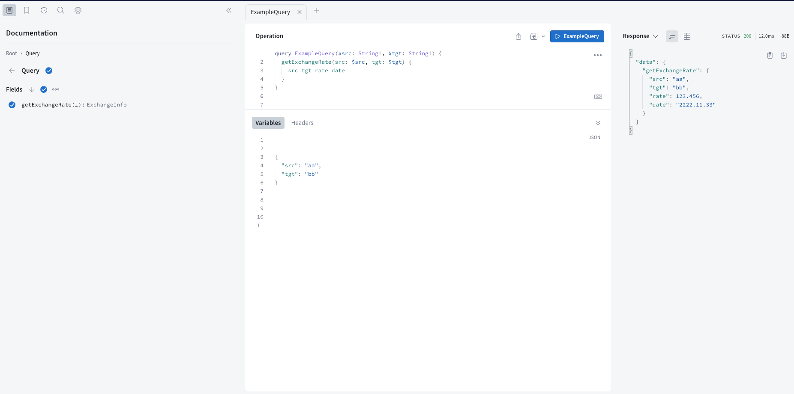
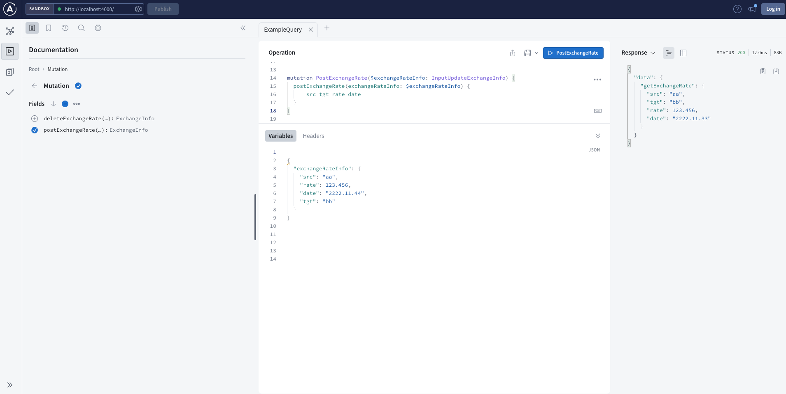
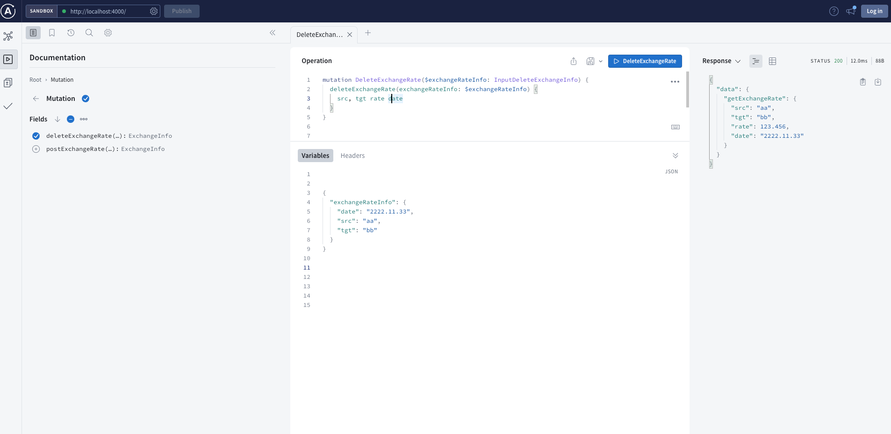

# 라이브러리 설치

```bash
$ yarn
```

# DB 세팅

```bash
$ docker-compose up -d
```

# 실행

```bash
$ yarn dev
```


# 리서치
- [APOLLO](https://www.apollographql.com/docs/apollo-server/)
- [graphql 기초](https://tech.kakao.com/2019/08/01/graphql-basic/)

# Sandbox 

- http://localhost:4000/ 접근

### Select

- Query
```js
query ExampleQuery($src: String!, $tgt: String!) {
  getExchangeRate(src: $src, tgt: $tgt) {
    src tgt rate date 
  }
}
```

- Data
```js
{
  "src": "aa",
  "tgt": "bb"
}
```

- Example


### Save

- Query
```js
mutation PostExchangeRate($exchangeRateInfo: InputUpdateExchangeInfo) {
  postExchangeRate(exchangeRateInfo: $exchangeRateInfo) {
      src tgt rate date
  }
}
```

- Data
```js
{
  "exchangeRateInfo": {
    "src": "aa",
    "rate": 123.456,
    "date": "2222.11.44",
    "tgt": "bb"
  }
}
```

- Example


### Delete

- Query
```js
mutation DeleteExchangeRate($exchangeRateInfo: InputDeleteExchangeInfo) {
  deleteExchangeRate(exchangeRateInfo: $exchangeRateInfo) {
    src, tgt rate date
  }
}
```

- Data
```js
{
  "exchangeRateInfo": {
    "date": "2222.11.33",
    "src": "aa",
    "tgt": "bb"
  }
}
```

- Example

